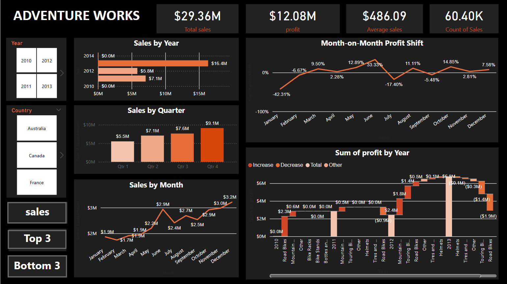
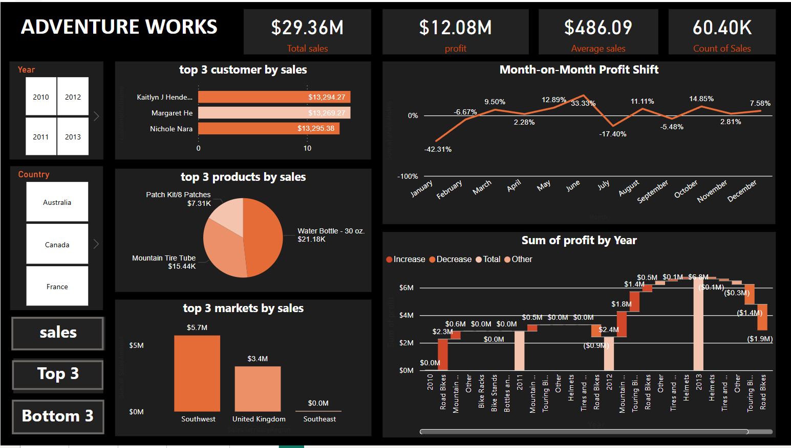

# powerbi
# 📊 Adventure Works Sales Dashboard

This repository contains **three Power BI dashboards** analyzing the sales performance of **Adventure Works**. The dashboards provide insights into **total sales, profit trends, top and bottom performers**, and **yearly profit distribution**.

## 🔖 Dashboard Bookmarks  

This report includes three **bookmarked dashboards** for interactive navigation:  
1. **Sales Dashboard** 📊 - Overview of total sales, profit, and performance metrics.  
2. **Top 3 Dashboard** 🏆 - Highlights the best-performing customers, products, and markets.  
3. **Bottom 3 Dashboard** 📉 - Identifies the weakest performers for improvement.  

📌 These bookmarks allow quick switching between key insights for better decision-making.

---

## 🏆 Sales Dashboard  

**Key Metrics:**  
✔️ **Total Sales:** $29.36M  
✔️ **Profit:** $12.08M  
✔️ **Average Sales Value:** $486.09  
✔️ **Total Sales Count:** 60.40K  

### 📈 Month-wise Profit Change  

| Month      | Profit Change (%) |
|------------|------------------|
| January    | -42.31% 📉 |
| February   | -6.67% 📉 |
| March      | +9.50% 📈 |
| April      | +2.28% 📈 |
| May        | +12.89% 📈 |
| June       | +33.33% 📈 |
| July       | -17.40% 📉 |
| August     | +11.11% 📈 |
| September  | -5.48% 📉 |
| October    | +14.85% 📈 |
| November   | +7.58% 📈 |
| December   | +2.81% 📈 |

📊 *The highest growth was in **June (+33.33%)**, while **January (-42.31%)** saw the biggest decline.*

---

## 📉 Waterfall Chart - Profit by Year  

✔️ **Profit increased significantly in 2013** ($6.8M).  
✔️ **Road Bikes and Helmets contributed the most to profit** in multiple years.  
✔️ **Touring Bikes saw major losses (-$1.9M in 2013)**.  
✔️ **2011 had a sharp decline (-$0.9M) in bike sales**.  

📌 *This chart visually represents profit gains and losses over time, helping understand yearly performance trends.*

---

## 🔥 Top 3 Performers  

### 🏆 Top 3 Customers by Sales:  
1️⃣ **Kaitlyn J Henderson** - $13.29K  
2️⃣ **Margaret He** - $13.27K  
3️⃣ **Nichole Nara** - $13.30K  

### 🏆 Top 3 Products by Sales:  
- **Water Bottle - 30 oz.** - $21.18K  
- **Mountain Tire Tube** - $15.44K  
- **Patch Kit/8 Patches** - $7.31K  

### 🏆 Top 3 Markets by Sales:  
- **Southwest** - $5.7M  
- **United Kingdom** - $3.4M  
- **Southeast** - $0.0M  

✔️ *These are the strongest segments, driving the highest revenue.*

---

## 📉 Bottom 3 Performers  

### 📉 Bottom 3 Customers by Sales:  
1️⃣ **David L** - $2.01K  
2️⃣ **Robert F** - $2.09K  
3️⃣ **Angela K** - $2.13K  

### 📉 Bottom 3 Products by Sales:  
- **Touring Tire** - $1.02K  
- **Bike Rack** - $1.89K  
- **Touring Pedals** - $2.19K  

### 📉 Bottom 3 Markets by Sales:  
- **Northwest** - $0.5M  
- **France** - $0.8M  
- **Japan** - $1.2M  

✔️ *These areas need improvement through targeted marketing and sales strategies.*

---

## 📢 Conclusion  

This dashboard analysis provides a **comprehensive view of sales performance**. It helps in **identifying strengths (Top 3)** and **areas needing improvement (Bottom 3)**, supporting strategic decision-making.

📌 **Key Takeaways:**  
✅ **Improve low-performing products and regions**.  
✅ **Optimize sales strategies for bottom-performing customers**.  
✅ **Leverage insights from top-performing segments**.  
✅ **Track month-wise profit shifts for better forecasting**.  

---

📌 **Developed with:** Power BI & Data Analysis 🖥️📊  
📢 **Author:** [shripad s malgatti]
